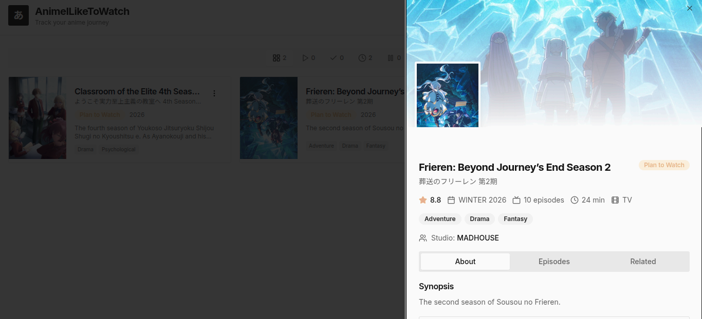

**あ**

`AnimeILikeToWatch` is a simple anime tracker built with React + TypeScript + Vite.

**App Link:**

**https://animeiliketowatch.netlify.app**

## What it does

- Track anime by status:
  - Watching
  - Completed
  - Plan to Watch
  - On Hold
  - Dropped
- Search anime from AniList
- View anime details
- Update episode progress
- Chat with AniBuddy for recommendations and quick actions
- Export/import your list as JSON backup
- Save data locally in your browser (`localStorage`)

## Notes

- AniList data requires internet access.
- List data is stored in browser storage, not a backend database.

## License

[MIT](./LICENSE)